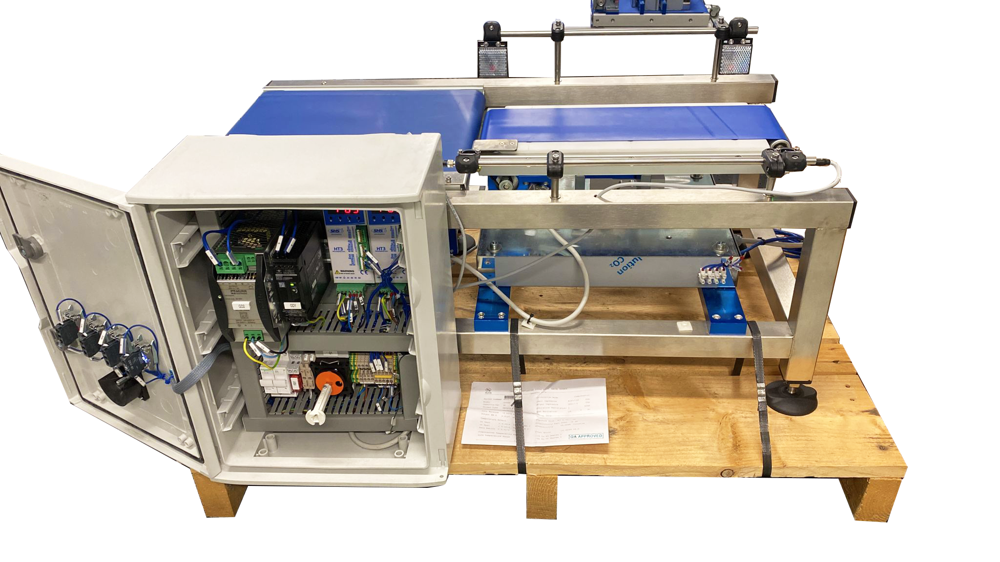

# Pesatura Dinamica
> Identificazione del peso tramite algoritmi di Machine Learning

L'individuazione del peso in maniera dinamica è un'applicazione attuabile in qualsiasi linea produttiva. Esso consente non solo di aumentare i ritmi produttivi evitando tempi morti, ma anche avere un costante controllo sulla massa dei pezzi prodotti. Scopo di questo progetto è lo sviluppo di un sistema predittivo per il calcolo del peso mediante tecniche di Machine Learning. A partire dai dati della cella di carico tramite un regressore lineare è possibile stimare il peso sul nastro trasportatore. 

  

## Tabella dei contenuti

- [Pesatura dinamica](#pesatura-dinamica)
  - [Tabella dei contenuti](#tabella-dei-contenuti)
  - [Strumentazione](#strumentazione)
  - [Taratura-Acquisizione](#taratura-acquisizione)
  - [Pre-Procesing ed estrazione features](#pre-procesing-ed-estrazione-features)
  - [Stima del peso tramite regressore Lineare](#stima-del-peso-tramite-regressore-lineare)
- [Componenti del gruppo](#componenti-del-gruppo)

## Strumentazione
La strumentazione utilizzata è la seguente:
- **Nastro trasportatore** del Laboratorio MMTLab;
- **Fotocellule:** Sick GL6
- **Schede di acquisizione** NI DAQ;
- **Cella di carico** HBM PW22C3 con fondo scala di *10 kg*

> I datasheet del seguente hardaware è presente nella seguente <a href="https://github.com/EdoGitMira/Gruppo_H_pesatura_dinamica/tree/main/datasheet" target="_blank">**cartella**</a> all'interno della repository.

## Taratura-Acquisizione
Per caratterizzare il comportamento del sistema di misura sono state svolte tre fasi:
- **Taratura della Cella** effettuata con 50 valori istantanei di tensione su 20 campioni di peso differente stimati utilizzando una bilancia di risoluzione di 0.01g tali da coprire il range 10-1500g. Il codice è reperibile al seguente <a href="https://github.com/EdoGitMira/Gruppo_H_pesatura_dinamica/tree/main/Script/Taratura_Statica" target="_blank">**link**</a> all'interno della repository.
- **Taratura statica sistema di acqusizione** sono stati attuati 5 cicli di carico e scarico, utilizzando 20 campioni non riferiti stimati utilizzando una bilancia di risoluzione di 0.01g tali da coprire il range 10-1500g.Il codice è reperibile al seguente <a href="https://github.com/EdoGitMira/Gruppo_H_pesatura_dinamica/tree/main/Script/Taratura_Statica" target="_blank">**link**</a> all'interno della repository.
- **Acqusizioni dinamiche** sono state considerate 4 velocità, per ciascuna si sono utilizzati 20 campioni per 35 misurazioni consecutive. Per tenere conto dei differenti fenomeni transitori generati dai vari oggetti misurati si è scelto di utilizzare tre corpi con forme diverse e variando la distribuzione di peso al loro interno. Il codice è reperibile al seguente <a href="https://github.com/EdoGitMira/Gruppo_H_pesatura_dinamica/tree/main/Script/Estrazione_Feature" target="_blank">**link**</a> all'interno della repository.

## Pre-Procesing ed estrazione features
I dati acquisiti mediante LabView vengono pre-processati tramite un filtro a 100 Hz; successivamente vengo analizzati, suddivisi in blocchi uniformi e caricati su un archivio Github reperibile al seguente <a href="https://github.com/EdoGitMira/Gruppo_H_pesatura_dinamica/tree/main/Dati%20grezzie" target="_blank">**link**</a>.
Il dataset è costituito da:
- **label:** il valore assunto vero ricavato dalle prove di statica iniziale e finale del carico mediante una media a indici ponderati
- **features:** consistono in N medie calcolate su N intervalli nel tratto utile del segnale 
Il dataset utilizzati per lo svolgimento del progetto sono reperibili alla seguente <a href="https://github.com/EdoGitMira/Gruppo_H_pesatura_dinamica/tree/main/dataset" target="_blank">**cartella**</a>

## Stima del peso tramite regressore Lineare
Lo sviluppo dell’algoritmo di identificazione del peso`e statoeffettuato tramite regressore lineare implementato con l’utilizzodel pacchetto *scikit-learn*. La  regressione è  stata  effettuata  partendo  dal  segnale  pre-processato e calcolando poi il valore del peso in V/V. 

Questa scelta è stata effettuata per generare una regressione che sia il più possibile robusta nei confronti dei disturbi esterni. Il regressore lineare sar`a quindi del tipo:

 

dove  rappresenta il peso predetto (in V/V),  rappresenta l'intercetta,  sono i coefficienti identificati dall'algoritmo e  rappresentano le feature del dataset. 

> Il notebook, implementato tramite Google Collab è presente nella seguente <a href="https://github.com/EdoGitMira/Gruppo_H_pesatura_dinamica/blob/main/Stima%20del%20Peso/Linear_regression.ipynb" target="_blank">**cartella**</a> all'interno della repository.

`N.B.` Nel codice sono presenti anche algoritmi di PCA, risultati poi poco efficaci nel nostro caso studio. Il dataset è presente al seguente <a href="https://github.com/EdoGitMira/Gruppo_H_pesatura_dinamica/tree/main/dataset" target="_blank">**link**</a>

# Componenti del gruppo
|**Gioavnni Alghisi**|**Francesco Campregher**|**Marco Milanesi** | **Edoardo Mirandola** | **Abdelghani Msaad**|
| :---: |:---:|:---:|:---:|:---:|
|g.alghisi002@studenti.unibs.it|f.campregher@studenti.unibs.it|m.milanesi004@studenti.unibs.it|e.mirandola@studenti.unibs.it|a.msaad@studenti.unibs.it|

